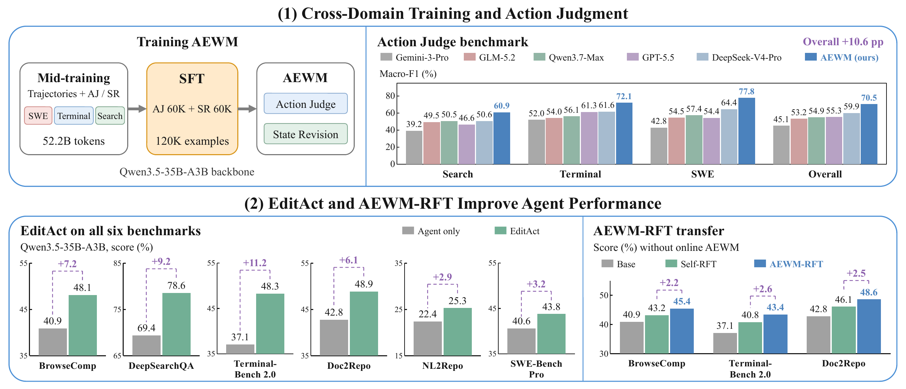
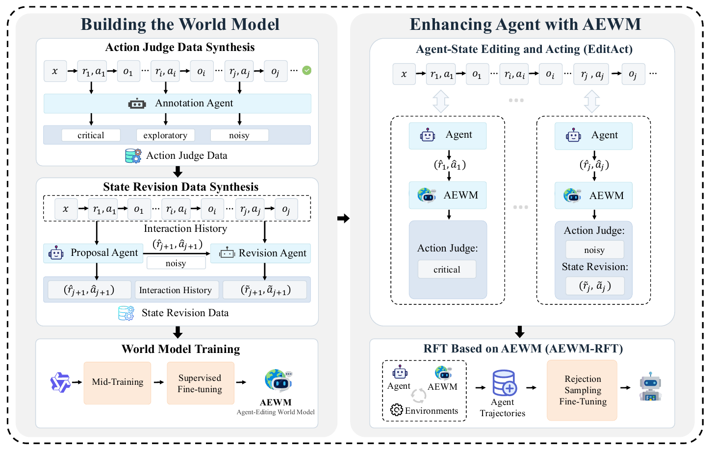
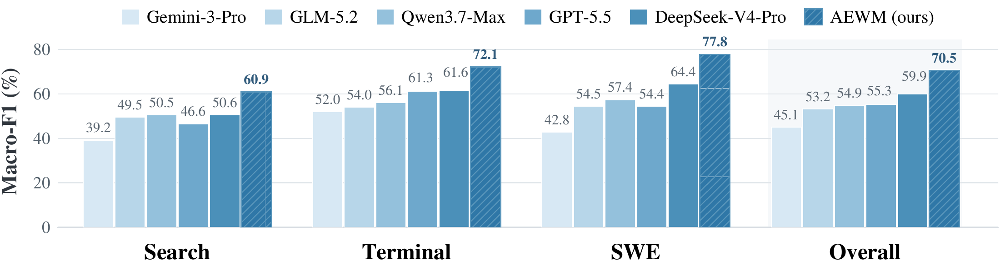
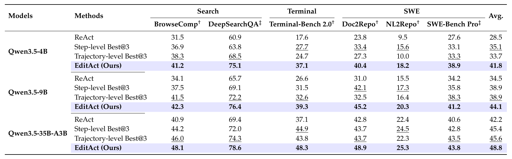

<h1 align="center">Agent-Editing World Model:<br>Rethinking World Modeling for LLM Agents</h1>

<p align="center">
  <b>EditAct: improving long-horizon agents through reasoning and action editing.</b>
</p>

<!-- TODO: replace ARXIV_ID with the paper identifier. -->
<p align="center">
  <a href="https://arxiv.org/pdf/2609.28416"></a>
  <a href="https://huggingface.co/RUC-AIBOX/AEWM"></a>
  <a href="https://huggingface.co/datasets/RUC-AIBOX/AEWM-Action-Judge-Bench"></a>
  
  <a href="LICENSE"></a>
</p>


> **AEWM models how an agent's decisions shape task progress, rather than predicting tool responses.** Its inference framework, **EditAct**, judges the proposed reasoning and action, edits noisy decisions, and executes the selected action in the real environment.

<p align="center">
  
</p>

<p align="center"><em>Learn to judge and edit decisions, improve agents during inference, and transfer the gains back into the agent.</em></p>

## Contents

- [Overview](#overview)
- [Action Judge Benchmark](#action-judge-benchmark)
- [Results](#results)
- [AEWM-RFT](#aewm-rft)
- [Quick Start](#quick-start)
- [Benchmark Evaluation](#benchmark-evaluation)
- [Documentation](#documentation)
- [Citation](#citation)
- [Acknowledgments and License](#acknowledgments-and-license)

## Overview

Long-horizon agents can suffer from **task-state contamination**: unsupported assumptions become accepted facts, outdated plans persist, and partial progress is mistaken for completion. Real observations alone do not ensure that the agent updates its reasoning correctly.

The **Agent-Editing World Model (AEWM)** addresses this problem by modeling the agent's reasoning and actions in the context of its observed history. It combines two capabilities:

| Component | Role |
| --- | --- |
| **Action Judge (AJ)** | Classifies a proposed decision as **Critical**, **Exploratory**, or **Noisy**, according to its expected contribution to task progress. |
| **State Revision (SR)** | Rewrites a noisy reasoning-action continuation from the same observed history, before the proposed action is executed. |

**EditAct** integrates these capabilities into the agent loop:

1. **Propose:** the agent generates its next reasoning and action.
2. **Judge:** AEWM assesses the proposal using the current history.
3. **Edit:** retain critical or exploratory decisions; revise noisy ones.
4. **Act:** execute the selected action with real tools and append the selected continuation and actual feedback to history.

<p align="center">
  
</p>

The same approach applies across **Search**, **Terminal**, and **Software Engineering (SWE)**. This repository provides three inference scaffolds:

| Domain | Scaffold | Tool interface |
| --- | --- | --- |
| Search | `editact_for_search` | `search_api`, `link_summary_tool`, `finish` |
| Terminal | `editact_terminal` | `execute_bash`, `str_replace_editor`, `finish` |
| SWE / Doc2Repo | `editact_for_swe` | `execute_bash`, `str_replace_editor`, `finish` |

**Learning agent editing.** We train a unified AEWM from Qwen3.5-35B-A3B in two stages: mid-training on approximately **52B tokens** of agent trajectories, AJ supervision, and SR supervision, followed by SFT on **120K curated examples**. The SFT set contains 60K AJ and 60K SR examples, with 40K examples per domain. Annotation uses observed outcomes to establish decision quality, while the model's input contains only the history and proposal available before execution. Revision examples are checked against real execution feedback, not simulated observations.

This is an **inference and evaluation code release**. It includes the scaffolds, domain prompts, reference configurations, runnable examples, and the Action Judge Benchmark evaluator. Model weights and benchmark data are distributed separately. Training data, trajectories, local environments, and credentials are not bundled.

## Action Judge Benchmark

**Can a world model identify useful and unproductive decisions before they are executed?** We evaluate this capability on a held-out benchmark of **3,000 decisions**, with **1,000 each from Search, Terminal, and SWE**. Search examples come from BrowseComp, Terminal examples from Terminal-Bench 2.0, and SWE pools Doc2Repo and NL2Repo.

Examples are drawn from verified trajectories, annotated three times, filtered for label consistency, reviewed against quality rubrics, and sampled for diversity. The evaluated model receives the task, available tools, pre-action history, and proposed reasoning-action pair. **The action's observation, subsequent trajectory, and gold label are withheld.** It predicts one of Critical, Exploratory, and Noisy; we report accuracy and macro-F1.

<p align="center">
  
</p>

**Action Judge results. Each cell reports accuracy / macro-F1 (%).**

| Model | Search | Terminal | SWE | Overall |
| --- | ---: | ---: | ---: | ---: |
| Gemini-3-Pro | 42.9 / 39.2 | 54.1 / 52.0 | 49.4 / 42.8 | 48.8 / 45.1 |
| GLM-5.2 | 48.9 / 49.5 | 55.3 / 54.0 | 58.5 / 54.5 | 54.2 / 53.2 |
| Qwen3.7-Max | 50.8 / 50.5 | 57.2 / 56.1 | 60.5 / 57.4 | 56.2 / 54.9 |
| GPT-5.5 | 48.7 / 46.6 | 62.8 / 61.3 | 59.2 / 54.4 | 56.9 / 55.3 |
| DeepSeek-V4-Pro | 50.9 / 50.6 | 63.0 / 61.6 | 68.6 / 64.4 | 60.8 / 59.9 |
| **AEWM (Ours)** | **64.7 / 60.9** | **73.3 / 72.1** | **79.5 / 77.8** | **72.5 / 70.5** |

AEWM achieves **70.5% overall macro-F1**, exceeding the strongest compared baseline by **10.6 points**. Its domain-level gains are **10.3, 10.5, and 13.4 points** on Search, Terminal, and SWE. The improvement across different tools and interaction patterns supports learning decision-level judgment rather than relying solely on a model's general instruction-following ability. Overall metrics pool all 3,000 decisions rather than averaging the domain scores.

**Run the benchmark:** obtain the evaluation data from the separate [Action Judge Benchmark dataset](https://huggingface.co/datasets/RUC-AIBOX/AEWM-Action-Judge-Bench), then pass the downloaded JSONL file to the [evaluator](benchmarks/action_judge/README.md). No search service or sandbox is needed.

```bash
python -m pip install 'openai>=1.66.0,<3.0.0' tqdm
export DATA_FILE="$HOME/datasets/AEWM-Action-Judge-Bench/action_judge_benchmark_3000.jsonl"
export EVAL_MODEL="your-served-aewm-model"
export EVAL_BASE_URL="http://localhost:8000/v1"
export EVAL_API_KEY="EMPTY"  # Replace for an authenticated endpoint.
export OUTPUT_DIR="results/action_judge/my_model"
bash benchmarks/action_judge/run.sh
```

Defaults are concurrency 5, temperature 1.0, and an 8,192-token output limit. The launcher resumes completed work and retries API failures. Results include per-domain and overall Accuracy / Macro-F1, with API and parsing errors reported separately. See the [benchmark guide](benchmarks/action_judge/README.md) for context requirements, data details, offline validation, and scoring.

## Results

The paper evaluates EditAct on **six benchmarks** with **three agent backbones**: Qwen3.5-4B, Qwen3.5-9B, and Qwen3.5-35B-A3B.

<p align="center">
  
</p>

**Average score across the six benchmarks (%):**

| Agent backbone | ReAct | Strongest baseline average | EditAct | Gain over strongest baseline |
| --- | ---: | ---: | ---: | ---: |
| Qwen3.5-4B | 28.5 | 35.1 | **41.8** | **+6.7** |
| Qwen3.5-9B | 34.5 | 38.9 | **44.1** | **+5.2** |
| Qwen3.5-35B-A3B | 42.2 | 45.6 | **48.8** | **+3.2** |

The strongest baseline is selected by its six-benchmark average among ReAct, step-level Best@3, and trajectory-level Best@3; gains are absolute percentage points.

EditAct improves performance across all six benchmarks and three backbones, including the out-of-distribution DeepSearchQA and SWE-bench Pro evaluations. **Qwen3.5-9B with EditAct outperforms Qwen3.5-35B-A3B with ReAct on the six-benchmark average (44.1 vs. 42.2)**, showing that learned agent editing can narrow performance gaps across model scales.

These are **paper results**, not scores from the quick-start examples. Reproduction requires the corresponding trained AEWM checkpoint, agent, task assets, and evaluation settings. Substituting a general instruction model for AEWM is a different experiment.

## AEWM-RFT

**Can the agent internalize the benefits of editing, without a world model at inference time?** AEWM-RFT uses **rejection sampling fine-tuning** on verified EditAct trajectories. The agent learns from both AEWM's local reasoning-action corrections and the subsequent interactions grounded in real feedback, transferring useful decision patterns into its own policy.

We compare two trajectory sources for the same Qwen3.5-35B-A3B agent: **Self-RFT** uses the agent's own ReAct rollouts, while **AEWM-RFT** uses AEWM-guided EditAct rollouts. The comparison matches task datasets, filtering strategy, training sample counts, and fine-tuning settings. The domain-specific agents are trained separately.

| Training domain | Self-RFT trajectories | AEWM-RFT trajectories |
| --- | ---: | ---: |
| Search | 4,000 | 4,000 |
| Terminal | 7,095 | 7,095 |
| SWE (DeNovoSWE) | 1,456 | 1,456 |

**All agents below use ReAct inference without online AEWM guidance. Each cell reports score (%) / average turns.**

| Method | BrowseComp | Terminal-Bench 2.0 | Doc2Repo |
| --- | ---: | ---: | ---: |
| Base agent | 40.9 / 56.2 | 37.1 / 83.1 | 42.8 / 78.1 |
| Self-RFT | 43.2 / 44.0 | 40.8 / 73.6 | 46.1 / 76.3 |
| **AEWM-RFT** | **45.4** / 39.3 | **43.4** / 69.2 | **48.6** / 89.8 |

AEWM-RFT improves over Self-RFT by **2.2 points on BrowseComp, 2.6 on Terminal-Bench 2.0, and 2.5 on Doc2Repo**. Search and Terminal improve while using fewer turns; Doc2Repo improves with more turns. The benefit is therefore not simply shorter trajectories: AEWM-guided supervision helps the agent allocate effort toward evidence acquisition, plan correction, and execution-based verification.

These training experiments are reported in the paper; this repository provides **EditAct inference**, not the RFT training pipeline or its trajectory datasets.

## Quick Start

### Installation

With **Python 3.11 or newer**, clone the repository and install:

```bash
git clone https://github.com/RUCAIBox/Agent-Editing-World-Model.git
cd Agent-Editing-World-Model
python -m venv .venv
source .venv/bin/activate
python -m pip install -e '.[editact]'
awe-agent info
```

The examples use public tool backends:

| Workflow | Requirements |
| --- | --- |
| All domains | An agent endpoint and a trained AEWM endpoint, both supporting OpenAI-compatible chat completions with native tool calls |
| Search | SerpAPI for search; Jina Reader for webpage access |
| Terminal / Doc2Repo | A running, accessible Docker daemon |

The Python Docker package alone does not provide a Docker daemon. The examples make real model and tool requests, which may incur API costs.

### Configure the Models

```bash
export ACTOR_MODEL="your-agent-model"
export ACTOR_BASE_URL="http://localhost:30000/v1"
export ACTOR_API_KEY="EMPTY"

export WM_MODEL="your-served-aewm-model"
export WM_BASE_URL="http://localhost:30001/v1"
export WM_API_KEY="EMPTY"
```

Replace the example values with your serving configuration. `EMPTY` is suitable only for endpoints that do not require authentication. Keep real credentials outside the repository.

The reference configurations preserve model reasoning and use native tool calls. Match the reasoning and sampling options to your serving backend. Search downloads the `Qwen/Qwen3.5-35B-A3B` tokenizer by default; set `TOKENIZER_PATH` to a local tokenizer directory for offline use. See the [configuration guide](docs/editact.md#configuration) for provider-specific settings.

### Search

```bash
export SERPAPI_API_KEY="your-serpapi-key"
# Optional, depending on your Jina Reader quota:
export JINA_API_KEY="your-jina-key"

bash examples/editact/run_search.sh
```

The example searches public sources, reads a page, and answers a short factual question.

### Terminal

```bash
docker info
# Optional overrides:
# export DOCKER_HOST="unix:///var/run/docker.sock"
# export SANDBOX_IMAGE="python:3.11-slim"

bash examples/editact/run_terminal.sh
```

The example creates a small data-processing script in a container, executes it, and verifies its output.

### Doc2Repo

```bash
bash examples/editact/run_doc2repo.sh
```

The example implements a small Python package from a specification and runs its tests. Terminal and Doc2Repo use disposable containers; avoid mounting sensitive host directories.

### Run Your Own Task

```bash
python examples/editact.py \
  --config configs/editact/doc2repo.yaml \
  --task-file /path/to/your/specification.md \
  --max-steps 100 \
  --timeout 10800 \
  --output results/editact/my_repository.json
```

Use `configs/editact/search.yaml` or `configs/editact/terminal.yaml` for the other domains. The shell examples also accept a custom instruction through the `TASK` environment variable.

Examples save trajectories under `results/editact/` and print the step count, successful revision count, and fallback count. Code examples also export a `.workspace.tar.gz` archive before removing the container. These examples **do not require benchmark data or assign benchmark scores**.

## Benchmark Evaluation

Reference configurations are provided for **BrowseComp**, **Terminal-Bench 2.0**, and **BeyondSWE-Doc2Repo**. Prepare the public datasets, benchmark-specific container images, and evaluator assets using the [dataset guide](datasets/README.md) and the recipes below.

| Benchmark | Configuration | Preparation guide |
| --- | --- | --- |
| BrowseComp | [search.yaml](configs/editact/search.yaml) | [Search recipe](recipes/deepsearch/README.md) |
| Terminal-Bench 2.0 | [terminal.yaml](configs/editact/terminal.yaml) | [Terminal recipe](recipes/terminal_bench_v2/README.md) |
| BeyondSWE-Doc2Repo | [doc2repo.yaml](configs/editact/doc2repo.yaml) | [BeyondSWE recipe](recipes/beyond_swe/README.md) |

After exporting the model and tool variables above, replace the data paths below and run:

```bash
# BrowseComp: three rollouts per task.
BROWSECOMP_DATA_FILE=/path/to/browse_comp_test_set.csv \
  awe-agent run -c configs/editact/search.yaml \
  --max-concurrent 4 --num-rollouts 3

# Terminal-Bench 2.0: three rollouts per task, with a 3h agent budget.
DATA_FILE=/path/to/terminal_bench_v2/instance_ids.json \
TASK_DATA_DIR=/path/to/terminal_bench_v2/tasks \
  awe-agent run -c configs/editact/terminal.yaml \
  --max-concurrent 4 --num-rollouts 3

# BeyondSWE: select Doc2Repo tasks and provide the matching test suite.
DATA_FILE=/path/to/beyond_swe.jsonl \
BEYONDSWE_TEST_SUITE_DIR=/path/to/doc2repo_test_suite \
  awe-agent run -c configs/editact/doc2repo.yaml \
  --max-concurrent 4 --num-rollouts 3
```

For BrowseComp, set `eval.judge_llm` in the configuration to use a separate answer grader; otherwise the actor endpoint is used. The Search recipe documents this setting. Page summarization also uses the configured model endpoint.

Concurrency counts active task rollouts, not individual model requests. AJ, SR, and page summarization introduce additional calls. Start with low concurrency and inspect the intervention audit before scaling. An invalid revision falls back to the original agent proposal; a finished trajectory alone does not confirm that every WM intervention succeeded.

For other tasks, use the existing task-specific prompts and evaluators and check their compatibility with the chosen AEWM checkpoint. The three examples above are starting points, not complete recipes for every benchmark in the paper.

## Documentation

| Resource | Contents |
| --- | --- |
| [EditAct guide](docs/editact.md) | Execution contract, configuration, context management, budgets, and failure handling |
| [Shared implementation](aweagent/scaffold/editact/) | AJ, SR, validation, and intervention auditing |
| [Domain prompts](aweagent/scaffold/editact/prompts/) | Search, Terminal, and SWE prompt definitions |
| [Reference configurations](configs/editact/) | Model, tool, runtime, and evaluation settings |
| [Runnable examples](examples/editact/) | Single-task Search, Terminal, and Doc2Repo launchers |
| [Framework guide](README_AweAgent.md) | Original framework APIs, scaffolds, tools, and runtimes |

Run the offline EditAct tests without model credentials:

```bash
python -m pip install pytest pytest-asyncio
python -m pytest \
  tests/scaffold/test_editact.py \
  tests/scaffold/test_editact_alignment.py
```

## Citation

If you use AEWM or EditAct in your research, please cite:

```bibtex

```

## Acknowledgments and License

EditAct builds on [AweAgent](https://github.com/AweAI-Team/AweAgent) and retains its original scaffolds, tools, runtimes, and evaluation workflows. We thank the teams behind [AweAgent](https://github.com/AweAI-Team/AweAgent), [CalibForge](https://github.com/AweAI-Team/CalibForge), and [DeNovoSWE](https://github.com/AweAI-Team/DeNovoSWE), as well as the authors of the underlying models and benchmarks.

The code is distributed under the [Apache-2.0 license](LICENSE). External model weights and datasets are subject to their respective licenses.
