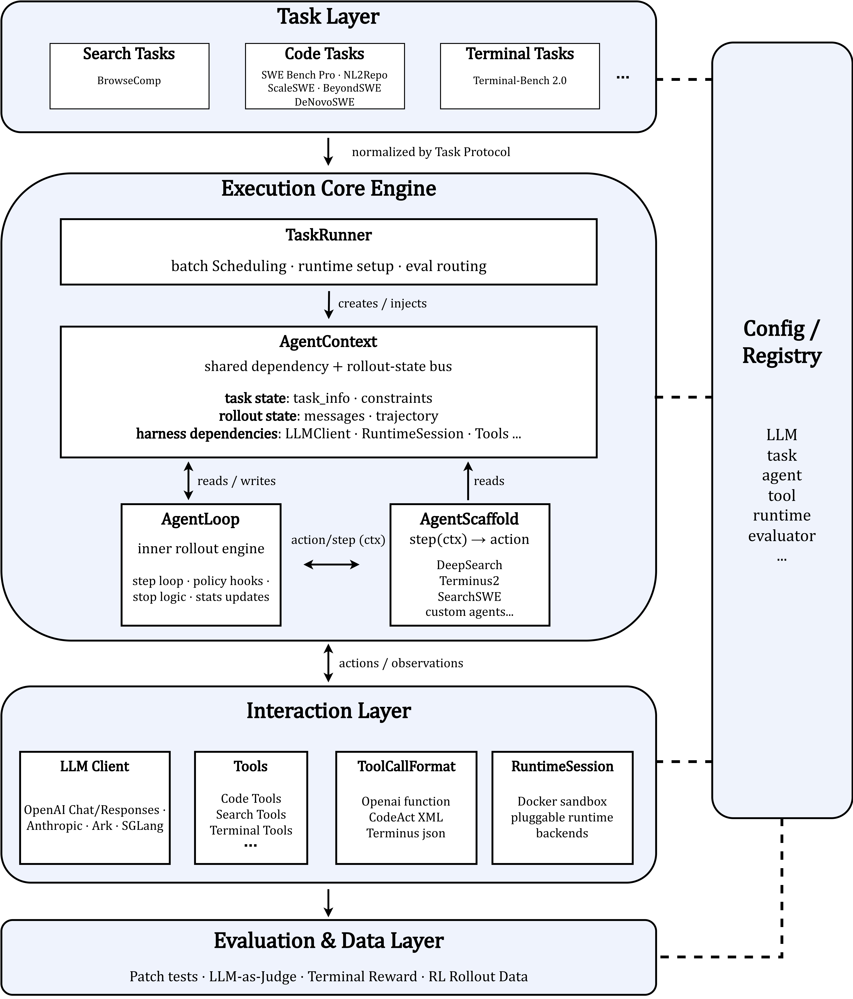

<div align="center">

<h1 align="center">
  
  &nbsp;AweAgent
</h1>

### Make Agent Research Systematic.

A unified, composable framework to build, evaluate, and train agents.

[](https://www.python.org/downloads/)
[](LICENSE)
<!-- [](https://github.com/AweAI-Team/AweAgent) -->

</div>

Agent research is **fragmented across domains and stages**: each task type tends to come with its own agent stack — code, search, terminal — and moving to RL usually requires rebuilding the rollout pipeline. Nothing carries over. AweAgent brings these pieces into **one composable framework** for building, evaluating, and training agents.

AweAgent's core capabilities:

- **Unified across task types** — search, code, and terminal agents run on the **same execution core**, with task-specific behavior composed through reusable interfaces instead of separate stacks.
- **Composable agent harnesses** — an agent is split into a `step(ctx) -> action` policy, the loop that runs it, and a context bus that carries state and dependencies; build new agents by recomposing these parts instead of forking the engine.
- **Protocol-centered extensibility** — LLM backends, tools, runtime sandboxes, agent scaffolds, tool backends, tasks, and evaluators are exposed through small protocols and entry-point registries; register a new component instead of patching the core engine.
- **Evaluation & trajectories as first-class data** — every run emits a structured result plus the full trajectory; code tasks can be evaluated in isolated Docker runtimes, and the experimental training path can collect token-level rollout data (loss mask · logprobs · weight versions).

## :newspaper: News

- `[2026-08-09]` 🎉 Updated the **Terminus-2** scaffold with a Harbor-aligned JSON reproduction for [Terminal-Bench 2.0](https://github.com/laude-institute/terminal-bench-2).
- `[2026-08-07]` 🎉 Added Terminal & [CalibForge](https://arxiv.org/abs/2608.06352) scaffolds support.
- `[2026-08-06]` 🎉 Added a **programmatic multi-benchmark eval server** (`aweagent.server.evaluate`), a **task registry** (`aweagent.task` entry points), and **multi-rollout evaluation** (`num_rollouts` / `--num-rollouts`) with per-instance pass@k.
- `[2026-06-10]` 🎉 Added Long-horizon & [DeNovoSWE](https://arxiv.org/abs/2606.10728) scaffolds support.
- `[2026-06-04]` 🎉 Added DeepSearch & [IterResearch](https://arxiv.org/pdf/2511.07327) scaffolds + [BrowseComp](https://arxiv.org/pdf/2504.12516) support.
- `[2026-05-10]` 🎉 Added [NL2Repo](https://arxiv.org/pdf/2512.12730) and [SWE-bench Pro](https://arxiv.org/pdf/2509.16941) task support.
- `[2026-03-16]` 🎉 Added unified **LLM backends** (openai/azure/response/ark/anthropic/sglang) with multi-provider reasoning support ([docs](docs/llm_client/README.md)).
- `[2026-03-15]` 🎉 Added Terminus-2 scaffold with [Terminal-Bench 2.0](https://github.com/laude-institute/terminal-bench-2) support.
- `[2026-03-01]` 🎉 Initial release with SearchSWE scaffold with [BeyondSWE](https://github.com/AweAI-Team/BeyondSWE) & [ScaleSWE](https://github.com/AweAI-Team/ScaleSWE).

## :jigsaw: Scaffolds

Reference agents shipped in-tree, all on the shared core.

| Scaffold | Type | Highlight | Resources |
|:--|:--|:--|:--|
| **OpenHands-style** | coding | CodeAct-XML coding agent, behavior-compatible with OpenHands (search off) | [code](aweagent/scaffold/search_swe) |
| **SearchSWE** | coding | SWE coding agent with web search & fetch — fixes repo issues, pulls in external docs | [code](aweagent/scaffold/search_swe) |
| **DeepSearch** | deep search | Base web-research QA agent; retry-until-answerable loop policy | [code](aweagent/scaffold/deepsearch) |
| **IterResearch** | deep search | Deep search + interaction scaling for long, multi-step research | [code](aweagent/scaffold/iter_research) |
| **CalibForge** | terminal | Code-agent scaffold with bash and file-editing tools for terminal tasks | [code](aweagent/scaffold/calibforge) |
| **Terminus-2** | terminal | tmux terminal agent driven by raw JSON keystrokes, on the standard loop | [code](aweagent/scaffold/terminus_2) |

<sub>**OpenHands-style** and **SearchSWE** are the same scaffold (`search_swe`), one `enable_search` flag apart — listed separately because they behave differently.</sub>

## :clipboard: Datasets & Benchmarks

**Training sets** — large-scale data for training / distilling agents:

| Dataset | Description | Scaffold | Resources |
|:--|:--|:--|:--|
| **ScaleSWE** | large-scale SWE-bench-style data | SearchSWE / OpenHands | [data](https://huggingface.co/datasets/AweAI-Team/Scale-SWE) · [guide](recipes/scale_swe/) |
| **DeNovoSWE** | doc2repo — implement a package from a natural-language spec | SearchSWE / OpenHands | [data](https://huggingface.co/datasets/AweAI-Team/DeNovoSWE) · [guide](recipes/denovo_swe/) |

**Test sets** — evaluation benchmarks:

| Benchmark | Description | Scaffold | Evaluation | Resources |
|:--|:--|:--|:--|:--|
| **BeyondSWE** | Doc2Repo · CrossRepo · DepMigrate · DomainFix | SearchSWE / OpenHands | isolated Docker patch test | [data](https://huggingface.co/datasets/AweAI-Team/BeyondSWE) · [guide](recipes/beyond_swe/) |
| **SWE-bench-Pro** | extended SWE-bench code tasks | SearchSWE / OpenHands | isolated Docker patch test | [data](https://huggingface.co/datasets/AweAI-Team/AweAgent-Meta-SWE-Bench-Pro) · [guide](recipes/swe_bench_pro/) |
| **SWE-bench Verified** | 500-instance human-verified SWE-bench split | SearchSWE / OpenHands | official SWE-bench harness † | [data](https://huggingface.co/datasets/SWE-bench/SWE-bench_Verified) · [guide](recipes/scale_swe/swebench_verified/) |
| **NL2Repo** | build a repo from a natural-language spec | SearchSWE / OpenHands | isolated Docker (artifact + golden tests) | [data](https://huggingface.co/datasets/AweAI-Team/AweAgent-Meta-NL2Repo) · [guide](recipes/nl2repo/) |
| **Terminal-Bench 2.0** | terminal tasks in containers | Terminus-2 / CalibForge | same-container reward | [repo](https://github.com/laude-institute/terminal-bench-2) · [guide](recipes/terminal_bench_v2/) |
| **BrowseComp** | web-search QA | DeepSearch / IterResearch | LLM-as-Judge | [guide](recipes/deepsearch/) |

<sub>† **SWE-bench Verified** is a *reproduction recipe* (`recipes/scale_swe/swebench_verified/`), not a framework-native task: the agent's patches are exported as predictions and scored by the **public SWE-bench harness** (with documented eval-side compatibility patches), reproducing the published Scale-SWE-Agent result. The other benchmarks run end-to-end through AweAgent's own isolated evaluator.</sub>

## :world_map: Roadmap

Long-term goal: practical, general-purpose agents optimized with reinforcement learning. Shipped so far — the five scaffolds plus the datasets & benchmarks above. Next:

- [ ] **Multi-agent** — multi-agent collaboration and orchestration on the shared core
- [ ] **RL training** — reinforcement-learning rollouts via [Slime](https://github.com/THUDM/slime) with an SGLang rollout engine *(experimental today)*

## :rocket: Installation

Requires **Python 3.11+** and **Docker** (for sandboxed execution and isolated evaluation).

### uv (recommended)

```bash
curl -LsSf https://astral.sh/uv/install.sh | sh

git clone https://github.com/AweAI-Team/AweAgent.git && cd AweAgent
uv venv --python 3.11 && source .venv/bin/activate
uv pip install -e .
```

### pip

```bash
git clone https://github.com/AweAI-Team/AweAgent.git && cd AweAgent
python -m venv .venv && source .venv/bin/activate
pip install -e .
```

A single `pip install -e .` runs every scaffold and benchmark, and all LLM backends except Volcengine Ark, out of the box. Optional extras: `".[ark]"` (Volcengine Ark backend) · `".[dev]"` (pytest · ruff · mypy).

> **Why editable (`-e`)?** You're installing from source and will likely tweak agents, tools, or configs — `-e` makes changes take effect without reinstalling. Verify everything is registered with `awe-agent info`.

## :arrow_forward: Running a Benchmark

### Download data

Datasets download through one script, run from the repo root. Data lands under `datasets/<task>/` — the path each task config defaults to — so afterward you can run with no extra env vars.

```bash
bash datasets/download.sh beyond_swe              # one task
bash datasets/download.sh all                     # everything wired
FORCE=true bash datasets/download.sh beyond_swe   # re-download
```

Wired today: **BeyondSWE · BrowseComp · Terminal-Bench 2.0**. See [`datasets/`](datasets/) for HF token / mirror options and per-task notes; other datasets are covered in each benchmark's guide.

### Run

```bash
# point at your LLM
export OPENAI_API_KEY="sk-..."

# sanity-check what's registered (backends, runtimes, agents, tools, tasks)
awe-agent info

# list instances — no Docker needed
python recipes/beyond_swe/run.py --data-file datasets/beyond_swe/beyond_swe.jsonl --mode dry-run

# batch run
python recipes/beyond_swe/run.py --data-file datasets/beyond_swe/beyond_swe.jsonl --mode batch
```

See each benchmark's guide for full setup, CLI arguments, and output format.

### Multiple rollouts (pass@k)

Evaluate each instance with several independent rollouts to estimate pass@k and
average pass rate instead of a single noisy sample. Set `--num-rollouts N` (or
`execution.num_rollouts` in YAML); the default is `1`, which is unchanged from a
single-rollout run.

```bash
awe-agent run -c configs/tasks/terminal_bench_v2.yaml --num-rollouts 3
```

All `N × instances` rollouts are scheduled together and throttled by
`execution.max_concurrent` (peak concurrency is unchanged — only wall-clock and
total work scale ~N×), so the run streams continuously rather than in per-pass
batches. Each pass writes its own `rollout_k/results.jsonl` + `trajectories.jsonl`
under the run directory. A rollout that fails on infrastructure (dead sandbox,
timeout, eval crash) is dropped from that instance's denominator and recorded in
`missing_rollouts.json`, so it can be re-run.

### Programmatic eval across benchmarks

`aweagent.server.evaluate` runs one served model across several benchmarks and
returns a per-benchmark score. Benchmarks resolve through the `aweagent.task`
registry; the model is any OpenAI-compatible endpoint (e.g. an SGLang server).

```python
import asyncio
from aweagent.server import evaluate

suite = asyncio.run(evaluate(
    "http://localhost:30000/v1",              # served model
    ["terminal_bench_v2", "swe_bench_pro"],   # benchmarks
    num_rollouts=[3, 1],                      # per-bench (int applies to all)
    concurrency=50,
))
for bench_id, score in suite.per_bench.items():
    print(bench_id, score.avg_pass_rate, score.pass_at_k)
```

`num_rollouts` accepts an int (same count for every benchmark) or a list of
ints matching `bench_ids` — e.g. `[3, 1]` runs Terminal-Bench-2 three times and
SWE-bench-Pro once.

`evaluate` only points the harness at the served endpoint and sets execution
knobs — it never launches the server or touches the (fixed) eval harness.
Benchmarks run sequentially to avoid oversubscribing a shared endpoint;
instances within a benchmark run concurrently.

## :building_construction: Architecture

<div align="center">
  
</div>

Four layers driven by a shared core — the figure maps 1:1 onto the modules below.

**Module descriptions**

- **TaskRunner** (`core/task`) — the batch engine: loads a `Task`, provisions its runtime, drives each instance through the loop, routes the result to an evaluator, and writes structured output (concurrency · retries · per-instance isolation).
- **AgentContext** (`core/agent`) — the shared bus: all rollout state (messages, trajectory, stats) plus every injected dependency (LLM, tools, tool-call format, runtime) and an optional `training` field. The single seam between the agent and the outside world.
- **AgentLoop** (`core/agent`) — the rollout engine: runs the step loop, branches only on the *kind* of action (finish · message · tool call), dispatches tools by name, and records the trajectory + RL tokens — agnostic to whether it's driving a search, code, or terminal agent.
- **Agent scaffold** (`scaffold/`) — the policy: a near-stateless `step(ctx) → action`. Built-ins: SearchSWE · DeepSearch · Terminus-2 · IterResearch · CalibForge.
- **Interaction layer** (`core/llm` · `core/tool` · `core/runtime`) — the pluggable dependencies the loop injects: LLM backends, tools, tool-call formats, and runtime sandboxes.
- **Evaluation & Data** (`core/eval` · `tasks/` · `integrations/`) — turns a finished run into a score (isolated Docker patch test · LLM-as-judge · in-container reward) **or** token-level RL rollout data (Slime bridge).
- **Config / Registry** (`core/config` · `plugins/`) — layered YAML config + entry-point registries that wire every part by name.

## :gear: Configuration

Configs are YAML files with environment-variable substitution (`${VAR}`, `${VAR:-default}`) and `!include` support.

### LLM Backends

| Backend | Config File | Required Env Vars |
|---------|-------------|-------------------|
| OpenAI | `configs/llm/openai.yaml` | `OPENAI_API_KEY` |
| OpenAI (Responses) | `configs/llm/openai_response.yaml` | `OPENAI_API_KEY` |
| Azure OpenAI | `configs/llm/azure.yaml` | `AZURE_OPENAI_API_KEY`, `AZURE_OPENAI_ENDPOINT` |
| Anthropic | `configs/llm/anthropic.yaml` | `ANTHROPIC_API_KEY` |
| Volcengine Ark | `configs/llm/ark.yaml` | `ARK_API_KEY`, `ARK_MODEL_ID` |
| SGLang | `configs/llm/sglang.yaml` | (self-hosted endpoint) |

### Environment Variables

Copy [`.env.example`](.env.example) to `.env` and fill in your values:

```bash
cp .env.example .env
```

Sections: **LLM Backend** (pick one — API key + endpoint), **Task Data** (`DATA_FILE`), and **Search Tools** (optional — `SERPAPI_API_KEY`, `JINA_API_KEY`, only for search mode). See each benchmark's recipe guide (linked in the table above) for the full list.

## :handshake: Contributing

Issues and PRs are welcome. AweAgent is built to be extended — adding an LLM backend, tool, runtime, agent scaffold, or evaluator means implementing a small protocol and registering one entry point, with no changes to the core engine. For development tooling, install with `pip install -e ".[dev]"` (pytest · ruff · mypy).

## :scroll: Citation

If AweAgent is useful in your work, please consider citing it and giving the repo a ⭐.

```bibtex
@misc{aweagent2026,
  author       = {{AweAI Team}},
  title        = {{AweAgent}: A Unified, Composable Framework to Build, Evaluate, and Train Agents},
  year         = {2026},
  howpublished = {\url{https://github.com/AweAI-Team/AweAgent}},
  note         = {GitHub repository}
}
```

## 📄 License

Released under the [Apache-2.0 License](LICENSE).

## 📨 Contact

Questions or feedback? Open an [issue](https://github.com/AweAI-Team/AweAgent/issues) or email `gx.chen.chn@gmail.com`.

## 🎗️ Supporters

This project is mainly developed and maintained by students from [RUC AI Box](https://github.com/RUCAIBox).
